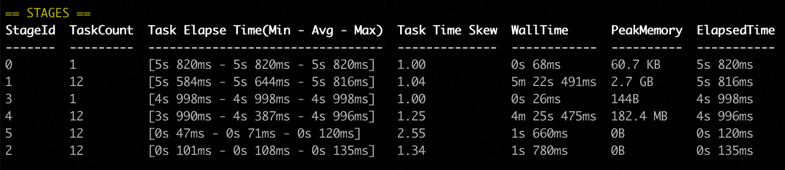
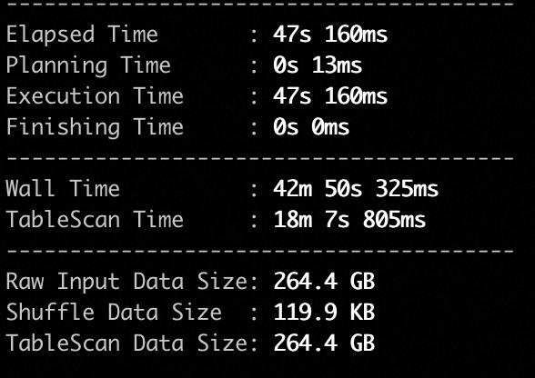
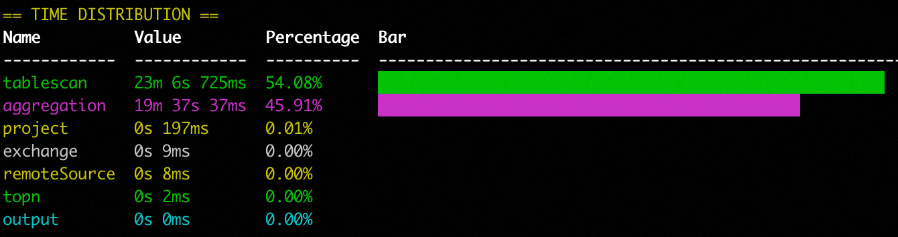

## Beauty

Beauty: beautiful things in the console.

I often have the needs to display some structured information in command line,
e.g. display some list of items as a table, display a bar chart etc, so I write a small piece of code to make 
this easy, currently it supports basic table:



It supports display an object into a key-value pair styled layout table:



and also it supports BarChart:



Enjoy!

### Usage

To display a table:

```java
String str = table(
        persons(),
        Arrays.asList(
                column("Name", (Person p) -> p.getName()),
                column("Age", (Person p) -> p.getAge()),
                column("Gender", (Person p) -> p.isMale() ? "Male" : "Female")
        ),
        x -> Color.NONE,
        Color.NONE
);

System.out.println(str);
```

To display one object in detail mode:

```java
String str = detail(
        persons().get(0),
        Arrays.asList(
                column("Name", (Person p) -> p.getName()),
                column("Age", (Person p) -> p.getAge()),
                column("Gender", (Person p) -> p.isMale() ? "Male" : "Female")
        ),
        Color.NONE
);

System.out.println(str);
```

To display a bar chart:

```java
String str = barChart(BarChart.intBarChart(Arrays.asList(
        new BarItem<>("Male", persons().stream().mapToInt(x -> x.isMale() ? 1 : 0).sum()),
        new BarItem<>("Female", persons().stream().mapToInt(x -> x.isMale() ? 0 : 1).sum()))));

System.out.println(str);
```

For more complete example, check out `src/test/org/abei/beauty/BeautyTest.java`